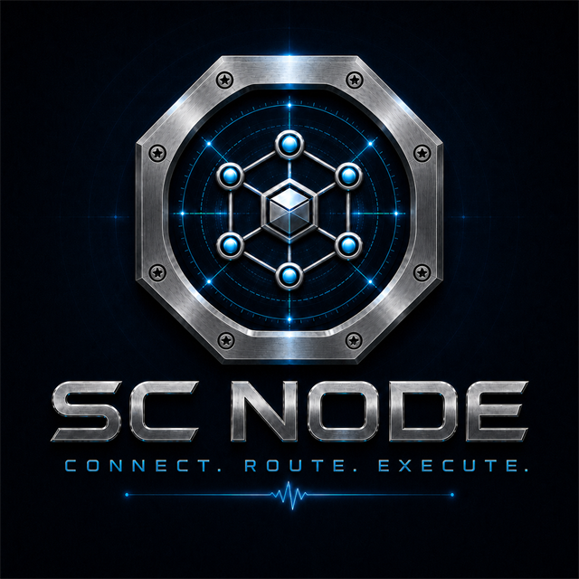
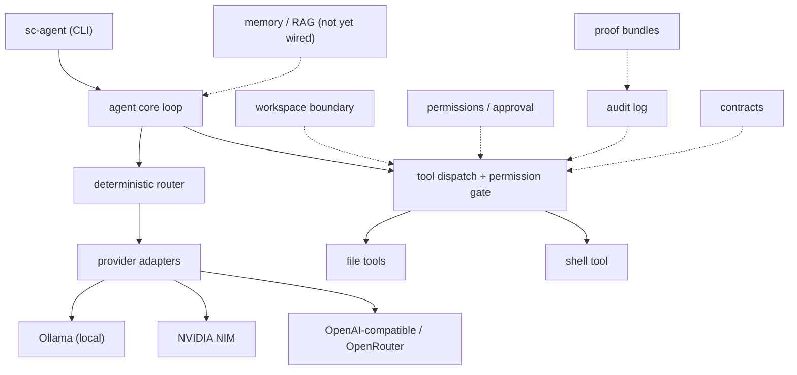

<div align="center">



**SC Node is an experimental, provider-neutral Rust agent harness for executing tool-using AI agents across local and cloud models.**

Public Alpha · Windows tested · Ollama and NVIDIA NIM live-tested · API may change

[](#license)
[](https://github.com/SC-LABS-ai/sc-node/actions/workflows/ci.yml)

</div>

---

## Why SC Node exists

Most agent frameworks are large, opinionated, and tied to a single vendor or a
heavyweight runtime. SC Node is the opposite: a small Rust execution layer that
runs a tool-using agent loop against whichever model you point it at — a local
Ollama model or an OpenAI-compatible cloud endpoint — with the safety controls
you actually want and nothing you don't. It is designed for low overhead,
local-first defaults, and honest, inspectable behaviour.

This is an **experimental public alpha**. The API may change, and only Windows
has been exercised so far. Feedback is welcome.

## What SC Node is

A lightweight Rust execution layer for agent loops. Its core provides:

- an **agent loop** that sends a task to a model, receives text and/or tool-call
  requests, executes tools, and feeds the results back for the next round (up to
  a bounded number of rounds);
- **streaming** responses (incremental SSE for OpenAI-compatible cloud providers);
- **tool dispatch** through a central permission gate;
- **deterministic routing** that resolves which provider/model handles a task,
  with local-first defaults and explicit cloud opt-in;
- a set of **optional control layers** you can turn on or off (see below).

## What SC Node is NOT

- **Not a desktop app.** It is a command-line binary (`sc-agent`) and a set of
  Rust crates.
- **Not a no-code builder.** Agents are configured in TOML and driven from a CLI.
- **Not a ChatGPT replacement.** It orchestrates models you bring; it is not a
  hosted chat product.
- **Not a finished end-user application.** It is an alpha harness for developers.

## Core features

- Provider-neutral agent loop with a tool-result feedback cycle.
- Real Ollama provider (local, on by default) and real NVIDIA NIM provider (cloud,
  opt-in), plus a shared OpenAI-compatible client used by cloud adapters.
- Deterministic 5-step provider/model routing with a hard cloud gate.
- File tools (`read_file`, `write_file`, `list_dir`) and a `shell` tool.
- Append-only JSONL audit log wired into every tool execution.
- No telemetry: zero outbound calls unless you enable a provider.

## Optional control layers

These controls are **modular and configurable — not mandatory overhead**. Enable
what fits your risk tolerance:

| Layer | What it does | Default |
|-------|--------------|---------|
| **Workspace boundary** (`sc-sandbox`) | Canonicalizes tool paths and checks them against an allow/deny list | On for file tools (empty allowlist = deny all) |
| **Permissions** (`sc-tool-core`) | Per-tool `allow`/`ask`/`deny` policies + allow/deny patterns, fail-closed | On (`ask` by default) |
| **Approval gate** | Interactive `y/N/a` prompt in the REPL on a TTY; `run` fails closed | REPL only |
| **Audit** (`sc-audit`) | Append-only JSONL record of every tool call | On (can be disabled) |
| **Contracts** (`sc-contract`) | Strict, fail-closed TOML execution-policy documents + policy hash | Opt-in (`contract` subcommand) |
| **Proof** (`sc-proof`) | Proof bundles with a SHA-256 hash chain over audit events + secret redaction | Opt-in (`proof` subcommand) |
| **Memory / RAG** (`sc-memory`) | Backend-agnostic memory store + reference backend | Present, **not yet wired** into the runtime |

## Quick start

```bash
git clone https://github.com/SC-LABS-ai/sc-node
cd sc-node
cargo build --release

# Create the default config at ~/.sc-agent/config.toml
./target/release/sc-agent init

# Run a one-shot task (requires Ollama running locally by default)
./target/release/sc-agent run "List the Rust files in the current directory"

# Or start the interactive REPL (interactive approval prompts require a TTY)
./target/release/sc-agent repl
```

On Windows the binary is `target\release\sc-agent.exe`. You can also run via
`cargo run --release -- <args>` during development.

## Build requirements

- A recent stable Rust toolchain. The workspace uses **edition 2024**, which
  requires **Rust 1.85 or newer**.
- No system libraries beyond what Cargo pulls in (TLS is via `rustls`, not
  OpenSSL).

Built and tested on Windows. Linux and macOS are unverified so far.

## Ollama example (local, live-tested)

Ollama is enabled by default and needs no API key.

```bash
ollama serve
ollama pull llama3.2:3b
./target/release/sc-agent run "Summarize the README in two sentences"
```

See [`examples/ollama/`](examples/ollama/) for a fuller walkthrough.

## NVIDIA NIM example (cloud, live-tested)

Cloud providers are opt-in. Enable NVIDIA NIM in your config and supply the key
via an environment variable — never in the config file.

```bash
# Windows PowerShell
$env:SC_AGENT_NVIDIA_API_KEY = "<your key>"
```

```toml
# ~/.sc-agent/config.toml
[providers.nvidia]
enabled = true
base_url = "https://integrate.api.nvidia.com/v1"
default_model = "meta/llama-3.3-70b-instruct"
```

See [`examples/nvidia-nim/`](examples/nvidia-nim/) for details.

## OpenAI-compatible provider support

The `sc-provider-core` crate provides a shared OpenAI-compatible client that
normalizes the differences between endpoints:

- tools are serialized in the `{"type":"function","function":{…}}` envelope that
  strict endpoints (e.g. NVIDIA NIM) require;
- a top-level `system` parameter is folded into a leading `system` message;
- responses are decoded as incremental Server-Sent Events (SSE).

NVIDIA NIM uses this client and is live-tested. An **OpenRouter adapter is
implemented on the same client but has not been live-tested yet.** See
[docs/PROVIDERS.md](docs/PROVIDERS.md).

## CLI commands

| Command | Description |
|---------|-------------|
| `sc-agent run <task>` | Execute a single task and exit |
| `sc-agent repl` | Start the interactive REPL |
| `sc-agent init` (alias `config-init`) | Create the default config at `~/.sc-agent/config.toml` |
| `sc-agent config-show` | Print the parsed config |
| `sc-agent config-set <key> <value>` | **Stub** — prints "not yet implemented" |
| `sc-agent providers-list` | List configured providers |
| `sc-agent models-list` | List models from enabled providers |
| `sc-agent audit-show [--last N]` | Show recent audit entries (default 50) |
| `sc-agent workspace-add <path>` | **Stub** — prints the manual config edit to make |
| `sc-agent doctor` | Check provider health, config, tools, workspace |
| `sc-agent contract validate <path>` | Validate a contract (fail-closed) and print its policy hash |
| `sc-agent contract explain <path>` | Print a human-readable contract summary |
| `sc-agent proof verify <path>` | Verify a proof bundle's hash chain and event count |

## Rust API

The workspace crates are **not published to crates.io** and the **API is
unstable**. You can use them as path dependencies, e.g. the fail-closed
execution-contract parser:

```rust
// Cargo.toml: sc-contract = { path = "…/sc-node/crates/sc-contract" }
use sc_contract::ExecutionContract;

let text = std::fs::read_to_string("task.contract.toml")?;
let contract = ExecutionContract::parse(&text)?; // strict, fail-closed
println!("policy hash: {}", contract.policy_hash()?);
```

## Architecture



Solid arrows are the live execution path; dotted boxes are optional control
layers. `memory / RAG` exists as a crate but is **not yet wired** into the
runtime. Full detail: [docs/ARCHITECTURE.md](docs/ARCHITECTURE.md).

## Execution flow

1. `main.rs` parses the CLI, loads the config, builds the enabled providers, the
   audit logger, and the tool registry into a `Session`.
2. The deterministic router resolves one provider/model for the task (explicit
   override → matching rule → configured fallback → first enabled local provider,
   with cloud gated behind an explicit opt-in).
3. The selected provider streams a response; text is printed and tool-call
   requests are collected.
4. Each tool call passes through the central permission gate: the decision is
   resolved (`Allow`/`Ask`/`Deny`) before any I/O; `Ask` is prompted in the REPL
   or denied in `run`.
5. Allowed tools execute; file paths are checked against the workspace boundary
   and shell commands run as an argument vector with a timeout.
6. Every outcome is written to the audit log, and the tool result is fed back
   into the conversation for the next round (bounded by a max-rounds limit).

## Configuration

Config lives at `~/.sc-agent/config.toml` on every platform (literally
`<home>/.sc-agent/config.toml` — not `%APPDATA%` or `~/.config`). Set the
`SC_AGENT_CONFIG` environment variable to use an alternate path.

```toml
[workspace]
allow = ["~/projects", "~/Documents"]

[permissions]
default_policy = "ask"

[providers.ollama]
enabled = true
base_url = "http://localhost:11434"
default_model = "llama3.2:3b"

[providers.nvidia]
enabled = false   # opt-in; key via SC_AGENT_NVIDIA_API_KEY

[routing]
fallback_provider = "ollama"
fallback_model = "llama3.2:3b"
```

The fully-commented reference is
[`examples/config.example.toml`](examples/config.example.toml).

## Credential handling

- API keys are read from environment variables only
  (`SC_AGENT_NVIDIA_API_KEY`, `SC_AGENT_OPENROUTER_API_KEY`). The key field is
  `#[serde(skip)]`, so a key placed in the TOML is ignored and a key is never
  written back by `config-show`.
- Keys are never written to disk and are redacted from provider error messages.
- Cloud providers are off by default; there is **no silent cloud fallback**
  (local-first routing, cloud only via an explicit rule/fallback/override).
- The shared cloud client refuses to attach a key to a non-`https`, non-local
  base URL.

## Testing

```bash
cargo test --workspace
```

Windows PowerShell helpers:

```powershell
powershell -ExecutionPolicy Bypass -File .\scripts\smoke-check.ps1
powershell -ExecutionPolicy Bypass -File .\scripts\verify-local.ps1
powershell -ExecutionPolicy Bypass -File .\scripts\verify-public-beta.ps1
```

The workspace ships an inline unit-test suite across the crates (routing,
permissions, sandbox, providers, contracts, proof, audit, config). Tests are
offline and deterministic; live provider calls only run when a real API key is
present in the environment.

## Benchmark status

SC Node is **designed for low overhead**, but **competitive performance is not
yet proven** and **no benchmark numbers are published**. See
[docs/BENCHMARKING.md](docs/BENCHMARKING.md) for the intended methodology.

## Known limitations

- Interactive approval is available only in the REPL on a real TTY; `sc-agent run`
  (and a piped REPL) fail closed — an `ask` decision is denied, not prompted.
- The shell deny-list is a substring blocklist, not a command parser; flag
  reordering can evade it (documented and tested).
- Shell command argument paths are not workspace-bounded — only the working
  directory is.
- No per-process resource limits (CPU/memory/pids); no Windows Job Object or
  Linux cgroup containment.
- The audit log is append-only, not cryptographically tamper-evident.
- A relative `audit.path` currently resolves against the process working
  directory rather than `data_dir`; use an absolute path if that matters to you.
- The sandbox has a check-then-open (TOCTOU) window.
- `sc-memory` is present but not wired into the runtime.
- Ollama streaming is batch-collect; cloud (OpenAI-compatible) streaming is
  incremental.
- Only verified on Windows; Linux/macOS and the OpenRouter adapter are unverified.

See [docs/SECURITY_MODEL.md](docs/SECURITY_MODEL.md) and
[THREAT_MODEL.md](THREAT_MODEL.md) for the full analysis.

## Roadmap

Near-term direction (no dates promised) — see [docs/ROADMAP.md](docs/ROADMAP.md):
stabilize the public Rust API, verify on Linux, publish a benchmark methodology
and first reproducible numbers, wire `sc-memory` into the runtime, and complete
the OpenRouter adapter.

## Contributing

See [CONTRIBUTING.md](CONTRIBUTING.md) and
[CODE_OF_CONDUCT.md](CODE_OF_CONDUCT.md).

## Security

See [SECURITY.md](SECURITY.md). Report vulnerabilities privately to
**contact@sclabs.uk** rather than opening a public issue.

## License

Dual-licensed under either of [MIT](LICENSE-MIT) or
[Apache-2.0](LICENSE-APACHE) at your option.
